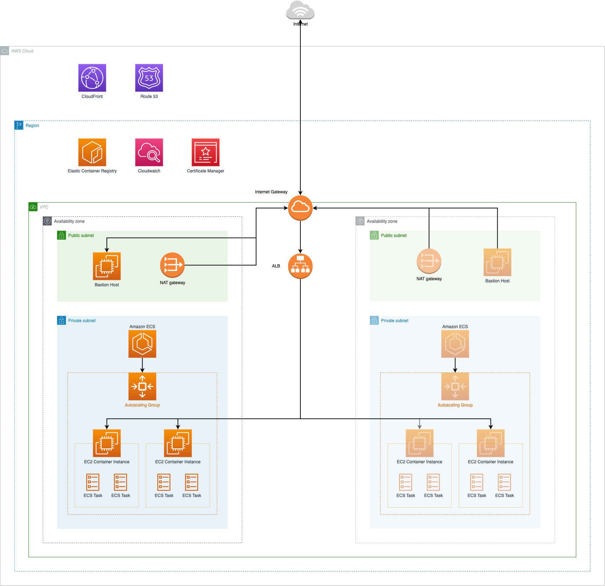

# Risklick Main Infrastructure

This repository contains the basic level of AWS infrastructure as infrastructure-as-code (IaC) using Terraform for the Risklick AWS cloud infrastructure.

## Target architecture
The target architecture on AWS including the service setups is the following:



The architecture fulfills the following key data:

- The setup should be high available.
- The setup should support autoscaling depending on the CPU and memory load on the system.
- The setup should support seamless deployments without downtime for each service.
- The setup uses three environments (`dev`, `test` and `prod`).
- The setup uses IaC with Terraform for all infrastructure deployments.
- A high level of automation is key to ensure business scalability.

The content of this repository and the [Proof-of-concept (PoC) repository](https://git.risklick.ch/ecs/poc) demonstrate a blueprint that can be adapted by Risklick for their individual services.
The main task for adapting this setup to their VM's is to adapt the PoC repository structure to each individual service.

In this repository, we make use of a Makefile that serves as a wrapper for more complex shell commands. 

## Glossary

### Service

A service describes a single application, for example a PHP app, a React app or something similar, that is running in one Docker container. 
Each service is mapped to one [ECS Service](https://docs.aws.amazon.com/AmazonECS/latest/developerguide/ecs_services.html) and is running in _1...n_ container instances _aka_ [ECS Tasks](https://docs.aws.amazon.com/AmazonECS/latest/developerguide/task_definitions.html).

### Layer

Inside the CI/CD pipeline, the setup uses different layers:

- **common**: This layer contains environment-independent infrastructure like certificates or Route53 configurations.  
- **environments-base**: The content of the environments-base layer is executed **once per environment**. Assuming we need three environments (`dev`, `test` and `prod`), we can configure our pipeline to create three independent infrastructures, each with its own Terraform state file and even in different AWS Accounts.

###

## Components of the main infrastructure

The main infrastructure consists of the following AWS resources:

- Certificates for the top-level domain (TLD)
- Route53 Hosted Zone for the TLD
- One Application Load Balancer (ALB) that will be used by all services
- An autoscaling group and a Launch Template for the EC2 Instances that belong to the ECS Cluster
- A bastion host EC2 instance that can be provisioned if there is a need to SSH into the EC2 instances
- Capacity providers with managed scaling for the autoscaling group
- An empty ECS Cluster (the ECS Services and their task definitions reside inside the service-related repositories)
- VPC with Internet Gateway
- Private and public subnet including NAT Gateway, route tables etc.

## Configuration

The following resources may require changes in the configuration:

### EC2 key pair

The EC2 key pair uses a standard SSH key. This key is part of the launch template definition and might be updated to a different version if needed. 
To do this, the public key (**not the private key**) must be updated in the variables file per environment inside `/infra/variables/<environment>/environments-base.tfvars`.

### Autoscaling group parameters

The following parameters might be changed, defined in variables inside `infra/layers/environments-base/vars.tf`:

- `ecs_ec2_instance_type`: Change the instance type for the EC2 instances used by the ECS Cluster
- `autoscaling_max_size` and `autoscaling_min_size`: Lower and upper limit in amount of instances for the autoscaling group
- `az_count`: If high availability is not desired, the amount of AZs can be reduced to 1. Please note that it is required to shutdown the environments-base layer and all services before doing this step.
- `maximum_scaling_step_size` and `minimum_scaling_step_size`: Describes the maximum/minimum amount of EC2 instances that should be added/removed during scale-out or scale-in

## How does the deployment work?

The setup is fully automated and therefore needs minimal interaction by the user.
The current configuration is a [trunk-based development](https://cloud.google.com/architecture/devops/devops-tech-trunk-based-development)-oriented setup where every Git commit is pushed directly to the main branch, triggering the Gitlab CI/CD pipeline that belongs to every repository.
For a setup like this, techniques like pair-programming are highly recommended to ensure a four-eye principle by benefiting at the same time from extensive knowledge sharing and the avoidance of knowledge bottlenecks. 
This setup aims for a high score according to Google's [DORA State of DevOps](https://dora.dev) research program and enables teams to continuously integrate and deploy new software for fast development and release cycles.

A deployment, triggered by a Git push, starts a new build in the CI/CD pipeline that is configured in Gitlab for this project. 
Each pipeline runs multiple [stages](https://docs.gitlab.com/ee/ci/pipelines/):

- Deployment of the common infrastructure layer
- Deployment of the environments-base layer, once per environment

The pipeline configuration is done within the `gitlab-ci.yml` file and is fairly simple. 
Please note that provisioning the initial version of the infrastructure might take some time (15-25 minutes), which is normal.

## Local development

> **! IMPORTANT !**  
Applying infrastructure changes from your local machine is **not** recommended. For a high level of documentation and automation, all steps should be executed by the Gitlab CI/CD environment.
Running the Makefile command for applying changes will not work, as it runs only when a certain environment variable is set, that is present by default inside Gitlab CI. 

It is recommended to run a `terraform plan` command after updating Terraform resources to check if any errors occur during the deployment. 
To do this, a local `.env.<environment>` including the values from the `.env.example` file must be present in the root directory.
You can create a copy of the example file and fill it with your IAM user access key credentials. 

> **! IMPORTANT!**  
**Never** commit any env files to Git, as they might include sensitive information.

When you have created a local env file according to the environment you want to test the `plan` command for, run the following commands:

```makefile
make init environment=dev layer=environments-base
make plan environment=dev layer=environments-base
```

Replace the value of `environment` and `layer` with the environment and layer you want to test:

- `environment` can be one of `dev`, `test` or `prod`
- `layer` can be one of `common` or `environments-base`

> **Good to know**  
You don't need a dedicated env file for the common layer. You can simply use the `dev`, `test` or `prod` env file for it.

## What you should not do

It is **not** recommended to change settings for resources created with Terraform manually inside the AWS console. 
Although this might look faster, you loose all the benefits of using IaC, especially the possibility of going back to a specific version of your infrastructure code.

The variable files inside `infra/variables` must not contain any sensitive data. All sensitive information (like passwords) must either be encrypted or passed via Secrets Manager.

## Destroying the infrastructure

Please note that in order to be able to destroy the generic infrastructure, all dependent services must be destroyed first. 
This is because of dependencies for target groups, security groups and other resources. For example: trying to destroy the infrastructure resources before the PoC infrastructure has been shut down will result in an error. 

To enable the destroy mode, update the following line for the corresponding layer/stage in the Gitlab CI config file and set the desory flag to `true`:

`make deploy layer=common environment=common destroy=false` --> `make deploy layer=common environment=common destroy=true`

## The GitLab CI/CD pipeline configuration

The project uses the default GitLab CI/CD pipeline. 
All Terraform commands run inside a Docker container to ensure the same runtime environment locally and in the pipeline.
To run Docker inside a GitLab pipeline, [Docker-in-Docker](https://docs.gitlab.com/ee/ci/docker/using_docker_build.html#use-docker-in-docker) is required.

**The Docker image is a standard Linux image containing Terraform and the AWS console. The image (defined in Makefile constant `DOCKER_IMAGE`) should be replaced with an image ownede by Risklick.**
